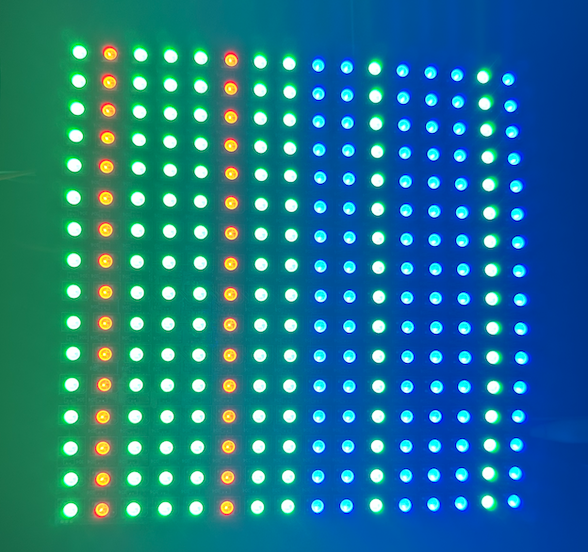

# WS2812B Driver

This driver is written in Lucid V2 for Alchitry Au FPGA (v1). Open this project using Alchitry Labs V2.

### Compiling the project

Open `alchitry_au.luc` and edit `COLUMN_DIMENSION` and `ROW_DIMENSION` values to match your LED matrix. If it is a strip, leave `ROW_DIMENSION` as `1`. Compile the project and then load to your Alchitry Au board.

**The default COLUMN and ROW dimension is set to 16. **

### How to use

Choose a mode using `io_dip[2][2:0]`:

- `000`: static mode
- `001`: manual mode
- `010`: RAM mode

#### Static mode

You will see a static pattern displayed on your matrix as follows. The pattern is made for a 16x16 WS2812B matrix.


The two green dots on the top right indicates the orientation of your matrix, that is top right pixel has address of `0`.

#### Manual mode

Press `io_button[1]` to **toggle** between `OFF` and `ON`. Upon `ON`, you should see it to be all green, with the blue dot indicating address `0`:


Set the color encoding using `io_dip[0]` and `io_dip[1]`. The encoding is as follows:

```verilog
    // WHITE (11), BLUE (10), RED (01), GREEN (00)
    const COLOR_ENCODING = {24hFFFFFF, 24hFF0000, 24h00FF00, 24h0000FF}
```

For example, we set it to be as such: `0001 0000 1010 0010`

Then press `io_button[0]` to latch the value. You should see the pattern shown on the LED.


```verilog
   led_encoding.d = ROW_DIMENSIONx{c{io_dip[1], io_dip[1], io_dip[0], io_dip[0]}}
```

Therefore effectively, per row we have the colors:

```
0001 0000 0001 0000 1010 0010 1010 0010
(left) green red green green green red green green blue blue green blue blue blue green blue (right)
```

You will see this "snaking" pattern, top right (address 0) start with blue:


You might need to reverse the index/pixel address of every other row since the matrix is usually made in **snaking** pattern. To do this, flip `io_dip[2][7]` switch. This utilises the module `index_reverser.luc` to reverse the index of every odd rows. For instance, in an 8x8 matrix, the following indexes are reversed:

- 8 to 15 is reversed to 15 to 8
- 24 to 31 is reversed to 31 to 24

Indexes of even rows (row 0, 2, 4, ...) remains the same. For instance, index 0 to 7 remains the same, so is 16 to 23 and so on.

You should see the pattern getting fixed as such:

/
